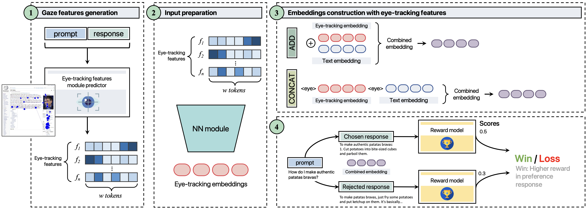

# Seeing Eye to AI: Gaze-Based Response Rewards for LLMs

This repository contains the official implementation for the paper "Seeing Eye to AI: Human Alignment via Gaze-Based Response Rewards for Large Language Models", presented at ICLR.

## Overview

This project introduces a novel approach to aligning Large Language Models (LLMs) with human preferences by leveraging eye-tracking data. By analyzing human gaze patterns during the reading of model responses, we develop a reward mechanism that captures implicit human feedback, enabling more effective alignment than traditional methods. Our approach demonstrates significant improvements in generating responses that better match human attention patterns and preferences.
<p align="center">
  
</p>

## Key Features

- Comprehensive eye-tracking data collection pipeline
- Novel gaze-based reward computation framework
- Fine-tuning methodology for LLMs using gaze-derived rewards
- Robust evaluation framework for measuring alignment improvements
- Support for multiple model architectures (Mistral, Llama, etc.)

## Installation

> **Note:** ET model 2 (Li & Rudzicz 2021) weights are not included in this repository due to file size limits.  
> You must train them separately (see [ET Model 2 Weights](#et-model-2-weights)) or copy them to `checkpoints/` before running.

### 1. Clone & environment setup

```bash
git clone https://github.com/kwskws1998/gaze_reward.git
cd gaze_reward
python -m venv .venv && source .venv/bin/activate   # python 3.11.8 권장
pip install -r requirements.txt
```

### 2. Install additional packages

```bash
pip install git+https://github.com/angelalopezcardona/tokenizer_aligner.git@v1.0.0
pip install git+https://github.com/angelalopezcardona/eyetrackpy.git@v1.0.0
```

### 3. ET Model weights setup (최초 1회)

ET model 1 가중치 자동 설치 + ET model 2 체크포인트 경로 등록:

```bash
python setup_et_models.py --et2-checkpoint ./checkpoints/et_predictor2_seed123
source .env_et   # ET2_CHECKPOINT_PATH 환경변수 등록
```

> `setup_et_models.py`가 하는 일:
> - SelectiveCacheForLM 레포에서 ET model 1 (T5-BiLSTM) 가중치를 eyetrackpy 패키지 내부로 자동 복사
> - ET model 2 체크포인트 경로를 `.env_et`에 저장

#### ET Model 2 Weights

ET model 2 가중치는 [Li & Rudzicz (2021)](https://aclanthology.org/2021.cmcl-1.9) 논문의 원본 코드를 재현하여 학습합니다.  
학습 데이터: ZuCo1, ZuCo2, PROVO (모두 공개 데이터셋)

```bash
# 데이터 준비 후 학습 (Provo 100 epochs → ZuCo 150 epochs)
python train_et_predictor2.py \
  --seeds 42,123,456 \
  --provo-epochs 100 \
  --task-epochs 150 \
  --lr 5e-5 \
  --batch-size 16

# 학습 완료 후 checkpoints/et_predictor2_seed123.safetensors 생성됨
```

재현 목표 MAE: `All (Dev) = 3.892` (논문 Table 6)

---

## Usage

### Baseline (ET 없이 순수 reward model)

```bash
python rlhf_rw/main.py \
  -d OpenAssistant/oasst1 \
  -m meta-llama/Meta-Llama-3-8B \
  --concat True \
  --use_softprompt False \
  --learning_rate 5e-5 \
  --lr_scheduler_type cosine_with_min_lr \
  --min_lr_ratio 0.7 \
  --batch_size 8 \
  --fp_dropout 0.1,0.3 \
  --seed 42
```

### GazeConcat fcomb2.2 (논문 Table 3 메인 결과)

```bash
python rlhf_rw/main.py \
  -d OpenAssistant/oasst1 \
  -m meta-llama/Meta-Llama-3-8B \
  --concat True \
  --use_softprompt True \
  --learning_rate 5e-5 \
  --lr_scheduler_type cosine_with_min_lr \
  --min_lr_ratio 0.7 \
  --batch_size 8 \
  --fp_dropout 0.1,0.3 \
  -fmv 2 \
  --features_used 0,1,0,1,0 \
  --seed 42
```

### 멀티 시드 (논문 재현: 3 seeds)

논문은 3개 시드 결과의 `mean ± std`를 보고합니다.  
아래 명령어로 시드 3개를 순서대로 실행합니다.

**Baseline 3시드:**
```bash
for SEED in 42 43 44; do
  python rlhf_rw/main.py \
    -d OpenAssistant/oasst1 \
    -m meta-llama/Meta-Llama-3-8B \
    --concat True --use_softprompt False \
    --learning_rate 5e-5 \
    --lr_scheduler_type cosine_with_min_lr \
    --min_lr_ratio 0.7 \
    --batch_size 8 \
    --fp_dropout 0.1,0.3 \
    --seed $SEED
done
```

**GazeConcat fcomb2.2 3시드:**
```bash
for SEED in 42 43 44; do
  python rlhf_rw/main.py \
    -d OpenAssistant/oasst1 \
    -m meta-llama/Meta-Llama-3-8B \
    --concat True --use_softprompt True \
    --learning_rate 5e-5 \
    --lr_scheduler_type cosine_with_min_lr \
    --min_lr_ratio 0.7 \
    --batch_size 8 \
    --fp_dropout 0.1,0.3 \
    -fmv 2 --features_used 0,1,0,1,0 \
    --seed $SEED
done
```

각 실행 완료 후 터미널에 출력되는 `results_dataset_test` 의 `eval_accuracy` 가 test set 기준 최종 결과입니다.  
3개 시드의 평균과 표준편차로 논문 수치와 비교하면 됩니다.

> **GPU 요구사항:** batch_size=8 기준 VRAM 40GB 이상 권장 (A100 40GB, RTX PRO 5000 48GB 등)  
> VRAM이 부족하면 `--batch_size 1 --gradient_acum_steps 8` 로 대체 가능하나 결과 편차가 커질 수 있습니다.

### Example: Training with HelpSteer2 dataset using Mistral-7B

```bash
python rlhf_rw/main.py \
  -d nvidia/HelpSteer2 \
  -m mistralai/Mistral-7B-v0.3 \
  --concat True \
  --use_softprompt True \
  --learning_rate 5e-5 \
  --lr_scheduler_type cosine_with_min_lr \
  --min_lr_ratio 0.7 \
  --batch_size 8 \
  --fp_dropout 0.1,0.3 \
  -fmv 1 \
  --seed 44
```

### Key Parameters

- `-d, --dataset`: 학습 데이터셋. `nvidia/HelpSteer2` 또는 `OpenAssistant/oasst1` 지원
- `-m, --model`: 베이스 모델. `mistralai/Mistral-7B-v0.3`, `meta-llama/Meta-Llama-3-8B`, `meta-llama/Meta-Llama-3-8B-Instruct` 지원
- `--concat`: `True` = GazeConcat, `False` = GazeAdd
- `--use_softprompt`: `False` = Baseline (ET 미사용), `True` = GazeConcat/GazeAdd (ET 사용)
- `--learning_rate`: 학습률 (논문 권장값: `5e-5`)
- `--lr_scheduler_type`: 스케줄러 타입 (논문 권장값: `cosine_with_min_lr`)
- `--min_lr_ratio`: cosine 스케줄러 최소 lr 비율 (논문 권장값: `0.7`)
- `--batch_size`: 배치 크기 (논문: `8`, VRAM 부족 시 `1` + `--gradient_acum_steps 8`)
- `--fp_dropout`: ET feature projector dropout (논문 권장값: `0.1,0.3`)
- `-fmv`: ET 예측 모델 버전. `1` = Huang & Hollenstein (2023), `2` = Li & Rudzicz (2021)
- `--features_used`: ET feature 선택 플래그 (nFix,FFD,GPT,TRT,fixProp 순서). `0,1,0,1,0` = fcomb2.2 (FFD+TRT)

## Citation

If you find this work useful for your research, please cite our paper:

```bibtex
@inproceedings{Lopez-Cardona2025Seeing,
  title     = {Seeing Eye to AI: Human Alignment via Gaze-Based Response Rewards for Large Language Models},
  author    = {Lopez-Cardona, Angela and Segura, Carlos and Karatzoglou, Alexandros and Abadal, Sergi and Arapakis, Ioannis},
  booktitle = {International Conference on Learning Representations (ICLR)},
  year      = {2025},
  url       = {https://openreview.net/forum?id=uZgK0tcPqd}
}
```

## License

© 2025 Telefónica Innovación Digital.  
Released under the GNU Lesser General Public License v3.0 (LGPLv3).  
See [LICENSE](./LICENSE) for details.
